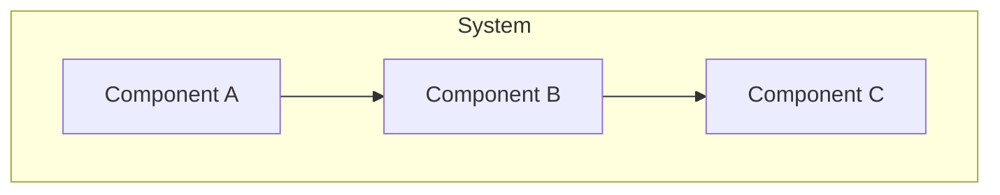
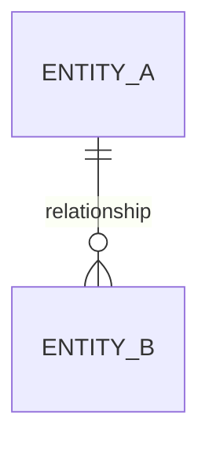

# Architecture Document: {initiative_name}

## Overview

<!-- High-level architecture description and key decisions -->

### Architecture Decision Records

| ADR | Decision | Status | Rationale |
|-----|---------|--------|-----------|
| ADR-1 | | Accepted/Proposed | |

## System Design

### Component Architecture

### Technology Stack

| Layer | Technology | Justification |
|-------|-----------|---------------|
| Frontend | | |
| Backend | | |
| Database | | |
| Infrastructure | | |

## Data Model

### Entity Relationships

### Schema Definitions

<!-- Key entity schemas -->

## API Design

### Endpoints

| Method | Path | Description | Auth |
|--------|------|-------------|------|
| GET | | | |
| POST | | | |

### Integration Points

| System | Protocol | Purpose |
|--------|----------|---------|
| | REST/gRPC/Event | |

## Security Architecture

<!-- Authentication, authorization, data protection -->

## NFR Alignment

<!-- How architecture addresses each NFR from the PRD -->

| NFR | Architectural Approach |
|-----|----------------------|
| Performance | |
| Security | |
| Scalability | |
| Reliability | |

## Deployment Architecture

<!-- Infrastructure, CI/CD, environments -->

## Monitoring & Observability

<!-- Logging, metrics, alerting strategy -->
