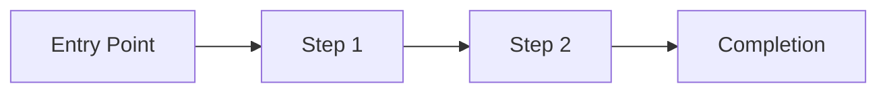

# UX Design Specification: {initiative_name}

## User Flows

### Primary Flow

<!-- Describe the main user journey -->

### Alternative Flows

<!-- Secondary paths and edge cases -->

### Error Flows

<!-- Error states and recovery paths -->

## Component Specifications

### Component: {name}

- **Type:** Page / Modal / Widget / Form
- **Trigger:** How the user reaches this component
- **States:** Default / Loading / Error / Empty / Populated

#### Layout

<!-- Describe the layout structure -->

#### Interactions

| Element | Action | Result |
|---------|--------|--------|
| | Click/Hover/Submit | |

#### Accessibility

- Keyboard navigation:
- Screen reader:
- Color contrast:

## Information Architecture

<!-- How content is organized and navigated -->

## Responsive Behavior

| Breakpoint | Layout Change |
|-----------|--------------|
| Mobile (< 768px) | |
| Tablet (768-1024px) | |
| Desktop (> 1024px) | |

## Design Tokens

| Token | Value | Usage |
|-------|-------|-------|
| Primary color | | |
| Font family | | |
| Spacing unit | | |
