# LENS Workbench — Lifecycle Visual Guide

**Module:** lens-work v3.2  
**Schema Version:** 3.2  
**Last Updated:** April 1, 2026

This guide provides a complete visual reference for the LENS Workbench lifecycle — from initiative creation through dev-ready execution, including every slash command, branch, commit, artifact, and PR along the way.

---

## Table of Contents

1. [Full Lifecycle Overview](#full-lifecycle-overview)
2. [Initiative Scoping & Creation](#initiative-scoping--creation)
3. [Milestone & Phase Architecture](#milestone--phase-architecture)
4. [Phase-by-Phase Walkthrough](#phase-by-phase-walkthrough)
5. [Branch Topology — Control Repo](#branch-topology--control-repo)
6. [Branch Topology — Target Projects](#branch-topology--target-projects)
7. [Promotion & Gate Sequence](#promotion--gate-sequence)
8. [Track Profiles](#track-profiles)
9. [Command Reference Matrix](#command-reference-matrix)
10. [v3.1 Enhancements](#v31-enhancements)

---

## Full Lifecycle Overview

```mermaid
flowchart TB
    subgraph ONBOARD["🚀 Onboarding"]
        OB["/onboard<br/>Bootstrap control repo"]
    end

    subgraph INIT["📋 Initiative Creation"]
        NI["/create-initiative<br/>domain · service · feature"]
    end

    subgraph TECHPLAN_MS["Milestone: techplan"]
        PP["/preplan<br/>🤖 Mary · Analyst"]
        BP["/businessplan<br/>🤖 John · PM + Sally · UX"]
        TP["/techplan<br/>🤖 Winston · Architect"]
    end

    subgraph DEVPROPOSAL_MS["Milestone: devproposal"]
        DP["/devproposal<br/>🤖 John · PM"]
    end

    subgraph SPRINTPLAN_MS["Milestone: sprintplan"]
        SP["/sprintplan<br/>🤖 Bob · Scrum Master"]
    end

    subgraph DEVREADY["Milestone: dev-ready"]
        DV["/dev<br/>🔧 Delegation to target repos"]
    end

    subgraph DEVCOMPLETE["Milestone: dev-complete (v3.1)"]
        DC["Dev-completion review<br/>All epics merged"]
    end

    OB --> NI
    NI --> PP
    PP -->|"auto-advance"| BP
    BP -->|"auto-advance"| TP
    TP -->|"auto-advance + promote"| GATE1{{"⚔️ Adversarial<br/>Review Gate"}}
    GATE1 --> DP
    DP -->|"auto-advance + promote"| GATE2{{"👥 Stakeholder<br/>Approval Gate"}}
    GATE2 --> SP
    SP -->|"auto-advance + promote"| GATE3{{"⚖️ Constitution<br/>Gate"}}
    GATE3 --> DV
    DV -->|"all stories merged"| DC
    DC -->|"dev-completion review"| CLOSE["/close<br/>completed"]

    style ONBOARD fill:#e8f5e9,stroke:#4caf50
    style INIT fill:#e3f2fd,stroke:#2196f3
    style TECHPLAN_MS fill:#fff3e0,stroke:#ff9800
    style DEVPROPOSAL_MS fill:#fce4ec,stroke:#e91e63
    style SPRINTPLAN_MS fill:#f3e5f5,stroke:#9c27b0
    style DEVREADY fill:#e0f2f1,stroke:#009688
    style DEVCOMPLETE fill:#e8f5e9,stroke:#4caf50
    style CLOSE fill:#efebe9,stroke:#795548
    style GATE1 fill:#ffcdd2,stroke:#f44336
    style GATE2 fill:#ffcdd2,stroke:#f44336
    style GATE3 fill:#ffcdd2,stroke:#f44336
```

---

## Initiative Scoping & Creation

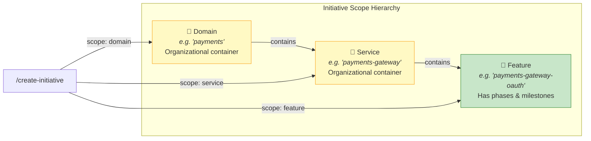

| Scope | Branch Created | Has Phases? | Config File |
|-------|---------------|-------------|-------------|
| Domain | `{domain}` | No | `_bmad-output/lens-work/initiatives/{domain}/initiative.yaml` |
| Service | `{domain}-{service}` | No | `_bmad-output/lens-work/initiatives/{domain}/{service}/initiative.yaml` |
| Feature | `{domain}-{service}-{feature}` | **Yes** | `_bmad-output/lens-work/initiatives/{domain}/{service}/{feature}.yaml` |

**On `/create-initiative` (feature scope):**
- **Branches created:** `{root}` (initiative root) + `{root}-techplan` (first milestone)
- **Commits:** `initiative.yaml` config file committed to `{root}` branch
- **Sensing:** Automatic cross-initiative overlap detection runs pre-creation

---

## Milestone & Phase Architecture

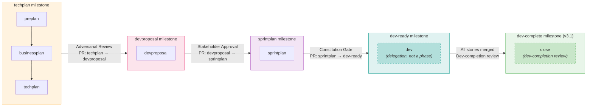

**Key concepts:**
- **Phases** are work stages within a milestone where artifacts are produced
- **Milestones** are branches that collect phase artifacts and gate promotions via PRs
- **Lazy creation:** Only `{root}` and `{root}-techplan` exist at init. Higher milestone branches (`devproposal`, `sprintplan`, `dev-ready`) are created on-demand at promotion time

---

## Phase-by-Phase Walkthrough

### Phase 1: PrePlan (`/preplan`)

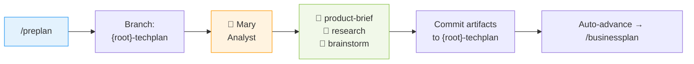

| Detail | Value |
|--------|-------|
| **Slash command** | `/preplan` |
| **Agent** | Mary (Analyst) |
| **Working branch** | `{root}-techplan` |
| **Artifacts committed** | `product-brief.md`, `research.md`, `brainstorm.md` |
| **PR created** | None (stays on same milestone branch) |
| **Auto-advance** | → `/businessplan` (no promotion needed) |

---

### Phase 2: BusinessPlan (`/businessplan`)

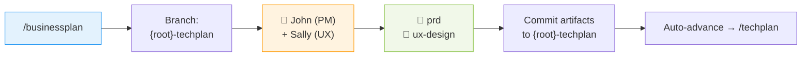

| Detail | Value |
|--------|-------|
| **Slash command** | `/businessplan` |
| **Agent** | John (PM), supporting: Sally (UX) |
| **Working branch** | `{root}-techplan` |
| **Artifacts committed** | `prd.md`, `ux-design.md` |
| **PR created** | None (stays on same milestone branch) |
| **Auto-advance** | → `/techplan` (no promotion needed) |

---

### Phase 3: TechPlan (`/techplan`)

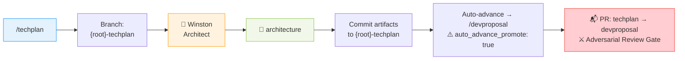

| Detail | Value |
|--------|-------|
| **Slash command** | `/techplan` |
| **Agent** | Winston (Architect) |
| **Working branch** | `{root}-techplan` |
| **Artifacts committed** | `architecture.md` |
| **PR created** | `{root}-techplan` → `{root}-devproposal` (milestone promotion) |
| **Gate** | Adversarial review (party mode) |
| **Auto-advance** | → `/devproposal` (with auto promotion) |
| **Branch created** | `{root}-devproposal` (lazy, at promotion time) |

**Adversarial Review Participants:**
| Artifact | Lead | Participants | Focus |
|----------|------|-------------|-------|
| product-brief | John | John, Winston, Sally | Actionable? Buildable? User-centered? |
| prd | Winston | Winston, Mary, Sally | Buildable? Well-researched? UX-aligned? |
| ux-design | John | John, Winston, Mary | Serves requirements? Technically feasible? |
| architecture | John | John, Mary, Bob | Meets spec? Practical? Sprintable? |

---

### Phase 4: DevProposal (`/devproposal`)

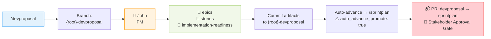

| Detail | Value |
|--------|-------|
| **Slash command** | `/devproposal` |
| **Agent** | John (PM) |
| **Working branch** | `{root}-devproposal` |
| **Artifacts committed** | `epics.md`, `stories.md`, `implementation-readiness.md` |
| **PR created** | `{root}-devproposal` → `{root}-sprintplan` (milestone promotion) |
| **Gate** | Stakeholder approval |
| **Auto-advance** | → `/sprintplan` (with auto promotion) |
| **Branch created** | `{root}-sprintplan` (lazy, at promotion time) |

---

### Phase 5: SprintPlan (`/sprintplan`)

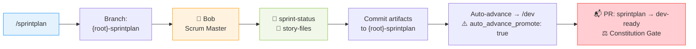

| Detail | Value |
|--------|-------|
| **Slash command** | `/sprintplan` |
| **Agent** | Bob (Scrum Master) |
| **Working branch** | `{root}-sprintplan` |
| **Artifacts committed** | `sprint-status.yaml`, individual story files |
| **PR created** | `{root}-sprintplan` → `{root}-dev-ready` (milestone promotion) |
| **Gate** | Constitution gate (4-level hierarchy) |
| **Auto-advance** | → `/dev` (with auto promotion) |
| **Branch created** | `{root}-dev-ready` (lazy, at promotion time) |

---

### Delegation: Dev (`/dev`)

```mermaid
flowchart LR
    CMD["/dev"] --> RESOLVE["Resolve target repo<br/>from initiative config"]
    RESOLVE --> TARGET["🔧 Target Project Repo<br/>{target_projects_path}/{domain}/{service}/{repo}"]
    TARGET --> EPICB["Branch: feature/{epic-key}"]
    EPICB --> STORYB["Branch: feature/{epic-key}-{story-key}"]
    STORYB --> IMPL["Implementation agents<br/>write code here"]
    IMPL --> STORYPR["📬 PR: story → epic<br/>Code review gate"]
    STORYPR --> EPICPR["📬 PR: epic → develop<br/>Feature-complete review"]

    style CMD fill:#e3f2fd,stroke:#2196f3
    style TARGET fill:#e0f2f1,stroke:#009688
    style STORYPR fill:#c8e6c9,stroke:#4caf50
    style EPICPR fill:#c8e6c9,stroke:#4caf50
```

| Detail | Value |
|--------|-------|
| **Slash command** | `/dev` |
| **NOT a lifecycle phase** | Delegation to implementation agents |
| **Working repo** | Target project (not control repo) |
| **Branches created** | `feature/{epic-key}`, `feature/{epic-key}-{story-key}` |
| **Commits** | Implementation code in target repo only |
| **PRs created** | Story → Epic (code review), Epic → develop (feature review) |
| **Control repo updates** | Sprint-status tracking only (in `_bmad-output/`) |

---

## Branch Topology — Control Repo

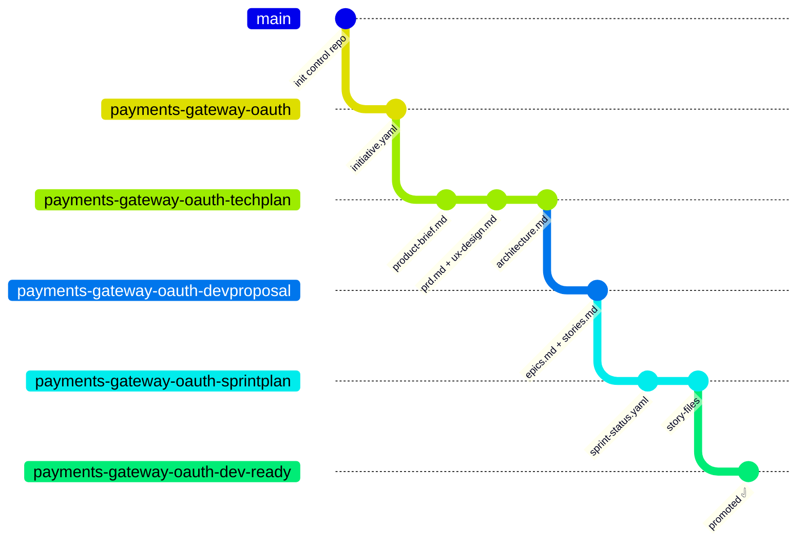

### Branch Lifecycle Summary

| Branch | Created When | Contains | Merged Via |
|--------|-------------|----------|------------|
| `{root}` | `/create-initiative` | `initiative.yaml` config | — (initiative root) |
| `{root}-techplan` | `/create-initiative` | PrePlan + BusinessPlan + TechPlan artifacts | PR → `{root}-devproposal` |
| `{root}-devproposal` | First promotion (lazy) | DevProposal artifacts | PR → `{root}-sprintplan` |
| `{root}-sprintplan` | Second promotion (lazy) | SprintPlan artifacts | PR → `{root}-dev-ready` |
| `{root}-dev-ready` | Third promotion (lazy) | All accumulated artifacts | — (execution baseline) |

### PR Summary — Control Repo

| PR | Source → Target | Gate | When Created |
|----|----------------|------|-------------|
| Milestone promotion 1 | `{root}-techplan` → `{root}-devproposal` | ⚔️ Adversarial review | After `/techplan` completes |
| Milestone promotion 2 | `{root}-devproposal` → `{root}-sprintplan` | 👥 Stakeholder approval | After `/devproposal` completes |
| Milestone promotion 3 | `{root}-sprintplan` → `{root}-dev-ready` | ⚖️ Constitution gate | After `/sprintplan` completes |

---

## Branch Topology — Target Projects

```mermaid
gitGraph
    commit id: "main"
    branch develop
    commit id: "develop base"
    branch feature/EPIC-1
    commit id: "epic scaffold"
    branch feature/EPIC-1-STORY-1
    commit id: "implement story 1"
    commit id: "tests + docs"
    checkout feature/EPIC-1
    merge feature/EPIC-1-STORY-1 id: "PR: story → epic"
    branch feature/EPIC-1-STORY-2
    commit id: "implement story 2"
    checkout feature/EPIC-1
    merge feature/EPIC-1-STORY-2 id: "PR: story → epic"
    checkout develop
    merge feature/EPIC-1 id: "PR: epic → develop"
    branch release/1.0
    commit id: "release prep"
    checkout main
    merge release/1.0 id: "PR: release → main"
```

| PR | Source → Target | Gate |
|----|----------------|------|
| Story completion | `feature/{epic}-{story}` → `feature/{epic}` | Code review |
| Epic completion | `feature/{epic}` → `develop` | Feature-complete review |
| Release cut | `develop` → `release/{version}` | Release readiness |
| Production deploy | `release/{version}` → `main` | Production gate |

---

## Promotion & Gate Sequence

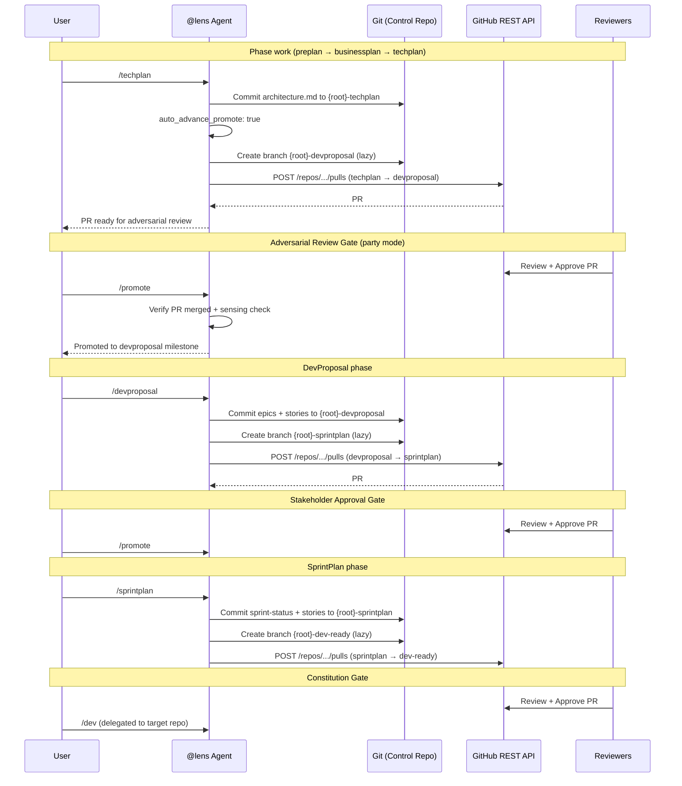

---

## Track Profiles

```mermaid
gantt
    title Lifecycle Tracks — Phase Coverage
    dateFormat X
    axisFormat %s

    section full
    preplan           :a1, 0, 1
    businessplan      :a2, 1, 2
    techplan          :a3, 2, 3
    devproposal       :a4, 3, 4
    sprintplan        :a5, 4, 5

    section feature
    businessplan      :b1, 1, 2
    techplan          :b2, 2, 3
    devproposal       :b3, 3, 4
    sprintplan        :b4, 4, 5

    section tech-change
    techplan          :c1, 2, 3
    devproposal       :c2, 3, 4
    sprintplan        :c3, 4, 5

    section hotfix
    techplan          :d1, 2, 3

    section hotfix-express
    techplan          :g1, 2, 3

    section spike
    preplan           :e1, 0, 1

    section quickdev
    devproposal       :f1, 3, 4

    section express
    expressplan       :h1, 0, 1
```

| Track | Phases | Milestones | Start | Use Case |
|-------|--------|-----------|-------|----------|
| **full** | preplan → businessplan → techplan → devproposal → sprintplan | techplan, devproposal, sprintplan, dev-ready | `/preplan` | Complete lifecycle |
| **feature** | businessplan → techplan → devproposal → sprintplan | techplan, devproposal, sprintplan, dev-ready | `/businessplan` | Known business context |
| **tech-change** | techplan → devproposal → sprintplan | techplan, devproposal, sprintplan, dev-ready | `/techplan` | Pure technical change |
| **hotfix** | techplan | techplan, dev-ready | `/techplan` | Urgent fix |
| **hotfix-express** | techplan | techplan, dev-ready | `/techplan` | Critical fix — bypasses constitution + adversarial review |
| **spike** | preplan | techplan | `/preplan` | Research only |
| **quickdev** | devproposal | devproposal, dev-ready | `/devproposal` | Rapid execution |
| **express** | expressplan | — (no milestones) | `/expressplan` | Solo/small — combined planning, no PRs |

---

## Command Reference Matrix

### Phase Commands

| Command | Code | Phase | Agent | Branch | Artifacts | PR Created | Auto-Advance |
|---------|------|-------|-------|--------|-----------|-----------|--------------|
| `/preplan` | PP | PrePlan | Mary (Analyst) | `{root}-techplan` | product-brief, research, brainstorm | — | → `/businessplan` |
| `/businessplan` | BP | BusinessPlan | John (PM) + Sally (UX) | `{root}-techplan` | prd, ux-design | — | → `/techplan` |
| `/techplan` | TP | TechPlan | Winston (Architect) | `{root}-techplan` | architecture | techplan → devproposal | → `/devproposal` (promote) |
| `/devproposal` | DP | DevProposal | John (PM) | `{root}-devproposal` | epics, stories, readiness | devproposal → sprintplan | → `/sprintplan` (promote) |
| `/sprintplan` | SP | SprintPlan | Bob (Scrum Master) | `{root}-sprintplan` | sprint-status, story-files | sprintplan → dev-ready | → `/dev` (promote) |
| `/dev` | DV | *(delegation)* | Implementation agents | Target repo branches | Code in target project | Story → epic, epic → develop | — |

### Utility Commands

| Command | Code | Purpose | Branches Affected | Output |
|---------|------|---------|-------------------|--------|
| `/onboard` | OB | Bootstrap control repo | None | `profile.yaml` |
| `/create-initiative` | NI | Create domain/service/feature | `{root}` + `{root}-techplan` | `initiative.yaml` |
| `/status` | ST | Show git-derived state | None (read-only) | Console output |
| `/next` | NX | Recommend next action | None (read-only) | Console output |
| `/switch` | SW | Change active initiative | Checkout existing branch | — |
| `/help` | HP | Show commands + version | None | Console output |
| `/discover` | DS | Inspect TargetProjects repos | None | `discovery-report` |
| `/module-management` | MM | Check/update module version | None | Console output |
| `/close` | CL | Complete/abandon/supersede | None (state change) | Close state |
| `/lens-upgrade` | UG | Migrate schema version | May update configs | Updated configs |
| `/dashboard` | DB | Cross-initiative status + Gantt | None (read-only) | Consolidated overview |

### Governance Commands

| Command | Code | Purpose | Gate Type | Sensing |
|---------|------|---------|-----------|---------|
| `/promote` | PR | Promote milestone (approval-only) | Per-milestone gate | Auto at promotion |
| `/sense` | SN | Cross-initiative detection (content-aware) | Informational or hard gate | On-demand |
| `/constitution` | CN | Resolve governance | 4-level hierarchy | — |

---

## Complete Artifact Inventory

| Phase | Artifact | File Pattern | Location |
|-------|----------|-------------|----------|
| PrePlan | Product Brief | `product-brief.md` | `_bmad-output/lens-work/initiatives/{path}/` |
| PrePlan | Research | `research.md` | `_bmad-output/lens-work/initiatives/{path}/` |
| PrePlan | Brainstorm | `brainstorm.md` | `_bmad-output/lens-work/initiatives/{path}/` |
| BusinessPlan | PRD | `prd.md` | `_bmad-output/lens-work/initiatives/{path}/` |
| BusinessPlan | UX Design | `ux-design.md` | `_bmad-output/lens-work/initiatives/{path}/` |
| TechPlan | Architecture | `architecture.md` | `_bmad-output/lens-work/initiatives/{path}/` |
| DevProposal | Epics | `epics.md` | `_bmad-output/lens-work/initiatives/{path}/` |
| DevProposal | Stories | `stories.md` | `_bmad-output/lens-work/initiatives/{path}/` |
| DevProposal | Readiness | `implementation-readiness.md` | `_bmad-output/lens-work/initiatives/{path}/` |
| SprintPlan | Sprint Status | `sprint-status.yaml` | `_bmad-output/lens-work/initiatives/{path}/` |
| SprintPlan | Story Files | `story-{id}.md` | `_bmad-output/lens-work/initiatives/{path}/` |

---

## Constitution Governance

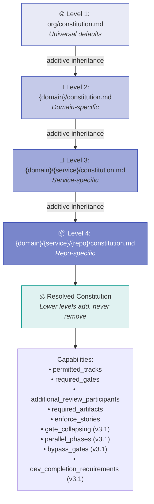

---

## v3.1 Enhancements

All 10 improvement suggestions from the original v3.0 visual guide have been implemented in v3.1. See [v3.1-improvements.md](v3.1-improvements.md) for full details.

| # | Improvement | Schema Key | Status |
|---|------------|-----------|--------|
| 1 | Promote as approval-only | `promote_semantics` | ✅ Implemented |
| 2 | Squash-merge + branch cleanup | `branch_cleanup` | ✅ Implemented |
| 3 | Express hotfix track | `tracks.hotfix-express` | ✅ Implemented |
| 4 | Parallel phase execution | `parallel_phases` | ✅ Implemented |
| 5 | Per-artifact validation hooks | `artifact_validation_hooks` | ✅ Implemented |
| 6 | Content-aware sensing | `content_aware_sensing` | ✅ Implemented |
| 7 | Dashboard command | `/dashboard` workflow | ✅ Implemented |
| 8 | Template artifact starters | `assets/templates/` | ✅ Implemented |
| 9 | dev-complete milestone | `milestones.dev-complete` | ✅ Implemented |
| 10 | Gate collapsing | `gate_collapsing` | ✅ Implemented |
