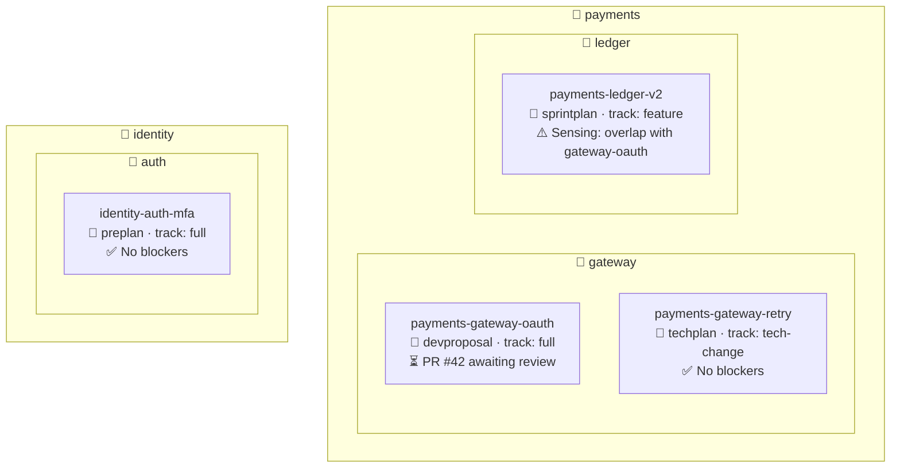

# Dashboard Workflow

**Command:** `/dashboard` (DB)
**Type:** Utility — read-only
**Added:** v3.1

## Purpose

Generate a consolidated multi-initiative status view showing all active initiatives
across domains with current phase, milestone, blocking PRs, and sensing alerts.
Replaces the need to `/switch` + `/status` repeatedly.

## Trigger

User runs `/dashboard` or the agent determines multi-initiative context is needed.

## Inputs

| Input | Source | Required |
|-------|--------|----------|
| All initiative branches | `git branch --list` | Yes |
| Open PRs | Provider adapter | Yes |
| Committed artifacts | `git show` per branch | Yes |
| Sensing data | Cross-initiative skill | Optional |

## Algorithm

### Step 1: Enumerate Active Initiatives

```
git branch --list | grep initiative patterns
```

For each branch matching `{domain}-{service}-{feature}*`:
- Extract initiative root from branch name
- Determine current milestone from branch suffix
- Read `initiative.yaml` from initiative root branch

### Step 2: Derive State Per Initiative

For each initiative:
1. **Phase**: Determine current phase from committed artifacts on milestone branch
2. **Milestone**: Current milestone branch (highest existing)
3. **Blocking PRs**: Query provider for open PRs matching branch patterns
4. **Last Activity**: Most recent commit timestamp on milestone branch
5. **Track**: Read from `initiative.yaml`
6. **Sensing**: Run lightweight overlap check

### Step 3: Generate Mermaid Dashboard



### Step 4: Generate Table Summary

```markdown
| # | Initiative | Domain | Service | Track | Phase | Milestone | Blocking PRs | Sensing | Last Activity |
|---|-----------|--------|---------|-------|-------|-----------|-------------|---------|--------------|
| 1 | gateway-oauth | payments | gateway | full | devproposal | devproposal | PR #42 | — | 2h ago |
| 2 | gateway-retry | payments | gateway | tech-change | techplan | techplan | — | — | 1d ago |
| 3 | ledger-v2 | payments | ledger | feature | sprintplan | sprintplan | — | ⚠️ overlap | 4h ago |
| 4 | auth-mfa | identity | auth | full | preplan | techplan | — | — | 3d ago |
```

### Step 5: Surface Recommendations

Based on dashboard state, recommend:
- Initiatives with stale PRs (> 48h without review)
- Sensing conflicts requiring attention
- Initiatives ready for `/promote`
- Initiatives idle for > 7 days

## Outputs

| Output | Format | Location |
|--------|--------|----------|
| Dashboard report | Markdown + Mermaid | Console (not committed) |

## Error Handling

- No initiatives found: Show onboarding guidance
- Provider API unavailable: Show branch-only view (no PR data)
- Large initiative count: Group by domain, paginate services
